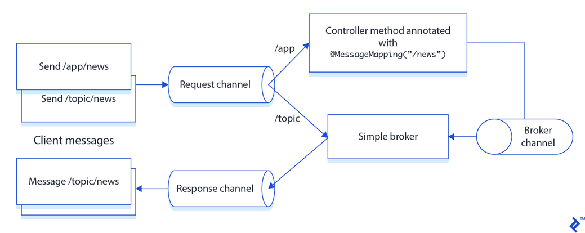
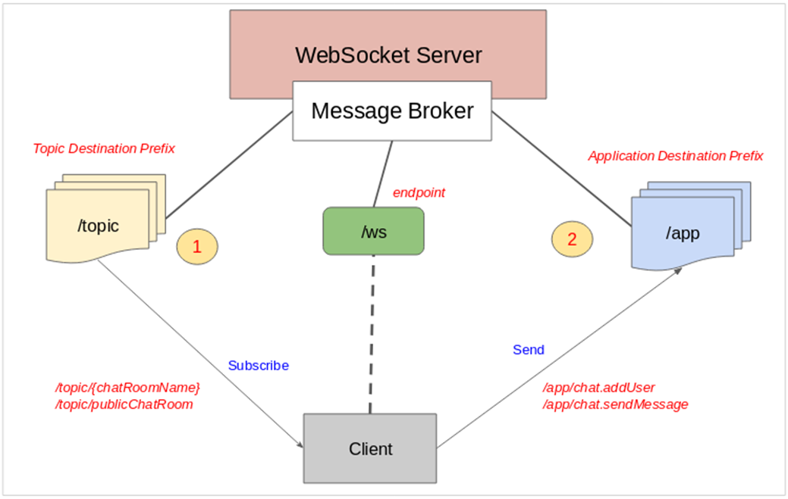

# **DEMO WEBSOCKET WITH SPRING**





WebSockets is a new way of communication, and it’s replacing the client/server web technology.

It allows long-held single TCP socket connections (kết nối socket TCP đơn lâu dài) between the client and server. It’s also called push technology, and it’s where the server can send data to the web without the client do long polling to request (bỏ phiếu để yêu cầu) a new change

This section shows you an example where you will send a message through a REST endpoint (Producer ) and receive the messages (Consumer ) using a web page and some JavaScript libraries.

MessageBroker giống như một người trung gian nó sẽ tiếp nhận những tin nhắn trước khi chuyển các tin nhắn tới các địa chỉ khác cần thiết.
MessageBroker phơi bầy ra một endpoint (Điểm cuối) để client có thể liên lạc và hình thành một kết nối. Để liên lạc client sử dụng thư viện SockJS để làm việc này

MessageBroker cũng phơi bẩy ra 2 loại điểm đến (destination)  (1) & (2)
Điểm đến (1) là các chủ đề (topic) mà client có thể “đăng ký theo dõi” (subscribe), khi một chủ đề có tin nhắn, các tin nhắn sẽ được gửi đến cho những client đã đăng ký chủ đề này.
Điểm đến (2) là các nơi mà client có thể gửi tin nhắn tới WebSocket Server

## SET UP

Thêm dependency vào file pom.xml của project:

```
<dependency>
    <groupId>org.springframework.boot</groupId>
    <artifactId>spring-boot-starter-websocket</artifactId>
</dependency>
```

The spring-boot-starter-websocket is the pom that will bring all the dependencies that you need for creating a WebSockets messaging application. Between the dependencies you will have all the spring-webmvc , spring-messaging, spring-websocket, and tomcat-embedded you need, so there is no need to include the spring-boot-starter-web dependency. The WebSockets starter pom will use them automatically

## NOTE

```
@Override
public void configureMessageBroker(MessageBrokerRegistry config) {
    config.enableSimpleBroker("/topic"); //carry messages back to client
    config.setApplicationDestinationPrefixes("/app");
    config.setUserDestinationPrefix("/users");
}

@Override
    public void registerStompEndpoints(StompEndpointRegistry registry) {
//        registry.addEndpoint("/ws").setAllowedOrigins("http://127.0.0.1:5500").withSockJS();
        registry.addEndpoint("/ws").setAllowedOriginPatterns("*").withSockJS();
}
```

config.enableSimpleBroker(“/topic”, "/queue"): Đây là cấu hình để kích hoạt một message broker đơn giản trong ứng dụng Spring WebSocket để chuyển các tin nhắn trở lại cho client. Các thông điệp được gửi từ server đến client sẽ được chuyển tiếp thông qua các địa chỉ /topic,

config.setApplicationDestinationPrefixes("/app"): Cấu hình định tuyến cho các yêu cầu từ client tới server. Khi một tin nhắn được gửi từ client đến server, tiền tố này sẽ xác định đường dẫn của tin nhắn và quyết định cách xử lý nó trong ứng dụng. Thông thường, các tin nhắn với tiền tố này được xử lý bởi các phương thức ứng dụng trên máy chủ. Trong trường hợp này, khi client gửi yêu cầu tới server, địa chỉ của yêu cầu sẽ bắt đầu với /app. Điều này giúp xác định các yêu cầu được gửi từ client đến server

config.setUserDestinationPrefix("/users"): Đây là cấu hình để xác định tiền tố cho các đích đến dành riêng cho người dùng. Điều này cho phép mỗi người dùng có thể đăng ký các đích đến riêng biệt, cho phép truy cập đến dữ liệu được gửi cho họ một cách riêng biệt. Khi sử dụng STOMP, các đích đến dành riêng cho người dùng thường được đặt tại /user hoặc /users để phân biệt với các đích đến chung khác.

**setApplicationDestinationPrefixes định nghĩa tiền tố cho các đích đến chung của ứng dụng, trong khi setUserDestinationPrefix định nghĩa tiền tố cho các đích đến riêng của từng người dùng.**


```
@MessageMapping("/send-to/{topic}") //maybe use @RequestMapping
@SendTo("/topic/message") //message is sent to /topic/message and then sent to client subscribing
public String sendToPublicMessage(@PathVariable String topic, @Payload Message message){
    return "[" + DateUtil.formatDate(message.getDate()) + "]: " + message.getSender() + " - " + message.getMessage();
}
```

@MessageMapping("/chat.public"): Đây là một annotation trong Spring WebSocket được sử dụng để ánh xạ các tin nhắn từ client tới server. Trong trường hợp này, "/chat.public" là đường dẫn của tin nhắn từ client. Khi một tin nhắn được gửi đến đường dẫn này, nó sẽ được xử lý bởi một phương thức cụ thể trên server.

@SendTo("/topic/message"): Đây là một annotation khác được sử dụng trong Spring WebSocket để gửi các tin nhắn từ server tới client. Trong trường hợp này, "/topic/messages" là địa chỉ đích mà tin nhắn sẽ được gửi tới. 

**Khi một tin nhắn được xử lý bởi phương thức được ánh xạ với @MessageMapping("/chat.public"), nó sẽ được gửi tới các clients đang subcribe nhận tin nhắn từ địa chỉ "/topic/messages"**

Ngoài ra, còn cách khác không cần sử dụng @MessageMapping và @SendTo, mà sử dụng SimpMessagingTemplate. Chú ý là phải cấu hình cor (ví dụ: @CrossOrigin(originPatterns = "*")):


```
@PostMapping("/send/{topic}")
public String sendPublicMessage(@PathVariable String topic, @RequestBody Message message){
    producer.sendPublicMessageTo(topic, message);
    return "[" + DateUtil.formatDate(message.getDate()) + "]: " + message.getSender() + " - " + message.getMessage();
}
```

@SendToUser(“/queue/message”): là 1 annotation trong Spring WebSocket được sử dụng để gửi tin nhắn tới một người dùng cụ thể. Cần xác định địa chỉ đích cho người dùng bằng cách sử dụng prefix như "/user/{userId}". Phù hợp khi cần gửi tin nhắn riêng cho từng người dùng. Thường được sử dụng trong các trường hợp như gửi tin nhắn cá nhân, thông báo riêng tư, hoặc phản hồi cho người dùng cụ thể. (Client nào send message thì server sẽ gửi message về cho client đó)

WebSocket gọi hàm configureClientInboundChannel khi cần thêm các logic xử lý trước hoặc sau khi các tin nhắn từ client được xử lý bởi Spring WebSocket. Điều này có thể bao gồm việc kiểm tra, xác thực hoặc thay đổi các tin nhắn trước khi chúng đến các phương thức xử lý (@MessageMapping) trong ứng dụng

Phương thức này là một interceptor được sử dụng trong Spring WebSocket. Nó giám sát và xử lý các tin nhắn trước khi chúng được gửi đi. Nếu tin nhắn là lệnh CONNECT, nó sẽ trích xuất thông tin về username từ headers và thiết lập user trong StompHeaderAccessor. Phương thức này có thể được sử dụng để xác thực hoặc ủy quyền người dùng trong quá trình kết nối WebSocket

Tham khảo:

https://topdev.vn/blog/gui-stomp-message-toi-mot-user-cu-the-voi-spring-websocket/

https://viblo.asia/p/co-ban-ve-giao-thuc-websocket-va-thu-vien-socketio-63vKjmmM52R

https://www.baeldung.com/spring-websockets-sendtouser

https://mokkapps.de/blog/sending-message-to-specific-anonymous-user-on-spring-websocket


